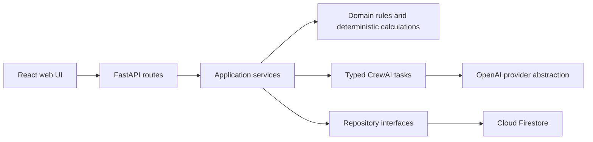
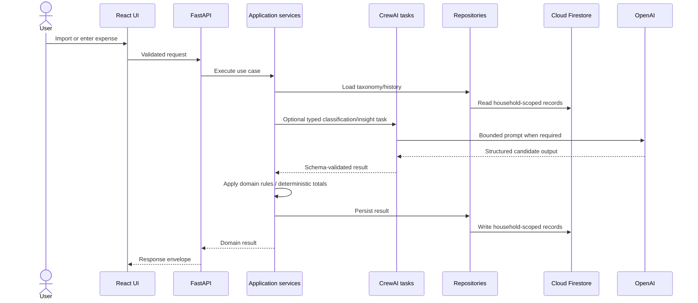
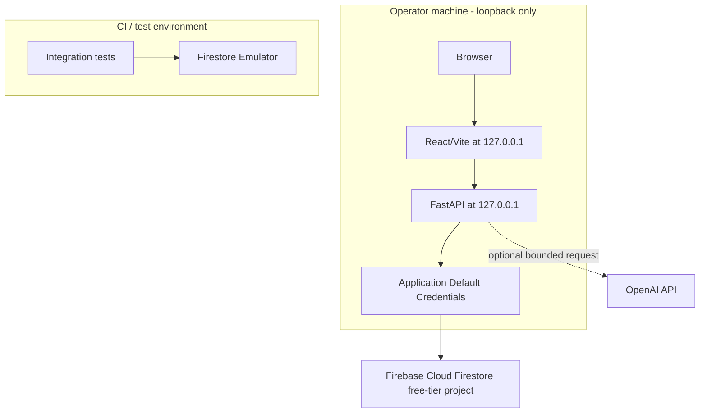

# System Architecture Document (SAD): Home Financial

## Context & Instructions

Home Financial is a web-first capstone MVP for Brazilian household personal finance awareness. It helps households import or register expenses, classify spending, review monthly totals, correct categories, and receive grounded educational insights in Portuguese (pt-BR).

This SAD translates the PRD and MRD into a high-level technical architecture for the AAMAD Build phase. It prioritizes an achievable MVP, deterministic financial calculations, explainable classification, sensitive-data handling, and a future-ready domain model for household accounts.

**PRD Document**: `project-context/1.define/prd.md`  
**MRD Document**: `project-context/1.define/mrd.md`  
**User Stories**: Generate `project-context/1.define/user-stories/` with `*create-stories` before Build.  
**MVP Scope**: CSV/manual expense input, categorization, correction history, monthly dashboard, pt-BR insights/fallbacks, export/deletion, and repeatable accuracy evaluation.  
**Selected Runtime**: `crewai`

## 1. MVP Architecture Philosophy & Principles

### MVP Design Principles

- Keep deterministic services authoritative for validation, arithmetic, persistence, deletion, export, and evaluation.
- Use CrewAI orchestration only where specialized agent boundaries improve clarity: categorization, monthly analysis, insight writing, and evaluation coordination.
- Prefer explainability over automation opacity: each classification and insight must expose its source, reason, confidence, and supporting data.
- Minimize sensitive data sent to LLM providers by using aggregated summaries and merchant/payee aliases by default.
- Provide exactly one shared local/demo household workspace without login, member identities, household selection, or role enforcement. Keep production authentication and membership as future domain extensions; do not present the demo as suitable for real financial data.
- Never send raw merchant/payee values or reversible alias mappings to an LLM provider. Send only an allow-listed projection containing a fictitious alias, business-context description, category hints, and aggregate recurrence behavior.
- Design for repeatable QA: golden-dataset evaluation, deterministic fallbacks, schema validation, and traceability to PRD acceptance criteria.

### Core vs Future Features

**MVP**:

- Local/demo household workspace.
- CSV import using the Portuguese schema from the PRD.
- Manual expense creation.
- Brazilian household category taxonomy.
- Classification with explicit source precedence, confidence scoring, a 0.70 review threshold, user corrections, and LLM fallback only for unresolved ambiguity.
- Monthly dashboard with exact totals, category/payment breakdowns, and month-over-month comparisons.
- Portuguese educational insights generated from structured summaries, with deterministic fallback summaries when LLM access fails.
- Data export as CSV and JSON.
- Demo/local household data deletion.
- Golden-dataset categorization evaluation with a 70% acceptance threshold.

**Future Work**:

- Production login/password registration and password recovery email.
- Production authorization for admin/member/viewer roles.
- Household invitations and external multi-user access.
- Direct bank integration, Open Finance, Pix-specific statement imports, and receipt scanning.
- Native mobile apps, PWA packaging, monetization, billing, audit log hardening, advanced observability, and compliance certification.
- Regulated financial, credit, investment, tax, or affordability advice.

### Technical Architecture Decisions

- **Frontend**: responsive React + TypeScript web application built with Vite, because the PRD requires web-first local/demo usage and mobile-friendly access.
- **Backend**: modular Python API built with FastAPI because `aamad.config.yml` declares Python as the primary language and `crewai` as the selected runtime.
- **Persistence**: Firebase Cloud Firestore on the free tier is the MVP runtime database, accessed by the FastAPI backend behind repository interfaces. The frontend never connects directly to Firestore. Local development uses server-side Application Default Credentials; unit tests use in-memory repositories, and integration tests use the Firestore Emulator. Keep the app local-only and use synthetic demo data until authentication and authorization are implemented.
- **LLM integration**: OpenAI provider abstraction with `gpt-4o-mini` as the default model name, configurable by environment variable.
- **LLM interaction mode**: non-streaming for MVP insight generation; responses are small, structured, and easier to validate before display.
- **Financial calculations**: never delegated to LLMs. Totals, percentages, comparisons, recurrence flags, and evaluation metrics are computed by deterministic services.

### Stakeholders and Concerns

| Stakeholder | Primary concerns | Architectural response |
| --- | --- | --- |
| Household organizer / demo user | Fast import, understandable monthly totals, correctable categories, privacy, export, and deletion | Responsive pt-BR UI; deterministic services; visible classification reasons; export/delete endpoints; synthetic data only |
| Shared-home member (future) | Shared access without exposing household data to other households or members | Household-scoped domain model; authentication, membership, and role enforcement remain future work |
| Demo operator / evaluator | Repeatable setup, measurable acceptance, predictable failure behavior, and controlled spend | Local-only app/API; emulator-backed integration tests; golden-dataset evaluation; deterministic insight fallback; provider usage metadata |
| Product owner | MVP scope, user value, and traceability from requirements to acceptance | P0 scope boundaries and PRD traceability matrix below |
| Build team | Stable contracts, understandable ownership, and testable components | FastAPI/OpenAPI contract; service and repository boundaries; typed agent outputs; CI checks |
| Privacy / security reviewer | Sensitive financial data, provider disclosure, access control, deletion, and secrets | Backend-only Firestore access; ADC/IAM; merchant aliases; prompt minimization; local-only API and synthetic demo data |

### Quality Attribute Scenarios

| ID | Attribute | Stimulus and response | Measure / source |
| --- | --- | --- | --- |
| QA-01 | Correctness | Given valid expenses, the API returns exact totals and category/payment breakdowns from deterministic services | 100% expected arithmetic in unit tests; PRD P0.7 |
| QA-02 | Performance | Given 50 valid demo rows, import completes within the target on a typical local development machine | < 5 seconds; PRD Performance Requirements |
| QA-03 | Availability / graceful degradation | When OpenAI is unavailable or times out, dashboard data remains available and insights use deterministic fallback | Fallback flow passes integration tests; PRD P0.8.5 |
| QA-04 | Privacy | During every provider request, raw merchant/payee values and reversible alias mappings remain backend-only | Zero raw values or mappings in every provider payload; prompt-schema tests; PRD P0.8.6 and SAD privacy decision |
| QA-05 | Modifiability | When persistence changes, application behavior remains behind repository interfaces | Domain services and tests do not depend on Firestore SDK types |
| QA-06 | Usability / accessibility | Users can complete import, review, correction, and deletion workflows in pt-BR across desktop and mobile viewports | PRD interface requirements and WCAG 2.1 AA intent; validated in QA |

### Architecture Decisions

| ID | Decision | Rationale | Consequence / trace |
| --- | --- | --- | --- |
| AD-01 | Use React + TypeScript + Vite and FastAPI | Matches the web-first PRD and configured Python runtime | Separate frontend/API contracts; local app ports bind to loopback; PRD P0.1-P0.9 |
| AD-02 | Use Firebase Cloud Firestore free tier through backend repositories | Matches the PRD storage choice while keeping persistence replaceable | Cloud project and server-side ADC/IAM setup are required; emulator is for integration tests; PRD Integration Requirements |
| AD-03 | Keep validation, classification precedence, aggregation, persistence, export, deletion, and evaluation deterministic | Exact financial results and reproducible acceptance must not depend on model output | CrewAI agents receive bounded tasks; aggregation uses deterministic functions only; PRD P0.2-P0.7, P0.10 |
| AD-04 | Use CrewAI sequentially for classification, analysis coordination, insight writing, and evaluation | Matches the selected runtime and separates responsibilities | Typed outputs, low iteration limits, no persistent agent memory; PRD Runtime & Agent Specifications |
| AD-05 | Use OpenAI through a provider abstraction for optional classification and insight generation | Keeps provider choice configurable and allows deterministic fallback | Credentials remain server-side; provider calls are bounded and measured; PRD P0.4, P0.8 |
| AD-06 | Run the app/API locally and do not expose an unauthenticated hosted service | The MVP has one shared workspace and no identity or authorization boundary | Synthetic data only; Cloud Firestore remains backend-only; future hosting requires route-level access control; PRD P0.1, Security & Compliance |
| AD-07 | Never send raw merchant/payee values or reversible mappings to an LLM provider | Minimize disclosure while still supporting useful merchant-aware insights | Build a separate allow-listed alias-safe projection; this is stricter than the optional less-restrictive PRD demo mode, which is not implemented |

### Architecture Views

The views below use the logical, process/runtime, deployment, and data viewpoints. Their catalogs identify the elements used in the presentations; the rationale/analysis records the important constraints and trade-offs.

#### Logical View

**Primary presentation**:



| Element | Responsibility | Boundary |
| --- | --- | --- |
| React web UI | Collect inputs and render backend results | No authoritative calculations or direct database access |
| FastAPI routes | HTTP validation, request IDs, response envelope | Thin transport layer |
| Application services | Coordinate use cases and transactions | Own workflow decisions, not persistence implementation |
| Domain rules | Validate expense/category behavior and calculate exact summaries | Deterministic and independently testable |
| CrewAI tasks | Categorization fallback, insight narration, evaluation coordination | Typed, bounded inputs/outputs; no authority over money arithmetic |
| Repository interfaces | Read/write domain records | Isolate Firestore-specific code |
| Provider abstraction | Call configured LLM and report provider failures/usage | Server-side secrets; deterministic fallback on failure |

**Rationale / analysis**: This separates user interaction, business rules, orchestration, and storage. The extra orchestration boundary is retained only where the PRD calls for agent-assisted classification and explanation; deterministic domain services remain authoritative.

#### Process / Runtime View

**Primary presentation**:



| Element | Runtime behavior | Failure behavior |
| --- | --- | --- |
| API request | Validate, assign request ID, invoke one application use case | Return field-specific errors; do not partially accept structurally invalid files |
| Classification task | Apply precedence; call LLM only for unresolved ambiguity | Use `outros` and flag review if no decisive fallback exists |
| Aggregation | Invoke deterministic aggregation functions | Return service error; never substitute LLM arithmetic |
| Insight task | Use precomputed summaries and alias-safe context | Timeout/provider/schema failure yields deterministic fallback |
| Repository operation | Read/write records scoped to the demo household | Return a structured storage error; do not report unpersisted writes as successful |

**Rationale / analysis**: The sequence keeps sensitive data and provider access in the backend. Persisted state changes only after validation; user-visible insight text is validated before display. Unit and integration tests exercise the deterministic and failure paths independently.

#### Deployment View

**Primary presentation**:



| Element | Placement / access | Security constraint |
| --- | --- | --- |
| Browser and Vite UI | Operator machine; loopback | No Firebase SDK credentials or direct Firestore access |
| FastAPI | Operator machine; loopback | No public/LAN bind; synthetic demo data only |
| Cloud Firestore | Firebase project, free-tier usage | Backend identity only; client rules deny direct access; IAM grants least privilege |
| OpenAI API | External provider, optional | Server-side key; alias-safe, bounded prompts by default |
| Firestore Emulator | CI/local integration tests | Isolated test data; never the production runtime store |

**Rationale / analysis**: This preserves the PRD's Cloud Firestore choice without exposing an unauthenticated API publicly. The backend Admin SDK is governed by Google Cloud IAM and bypasses Firestore Security Rules; therefore, least-privilege identity permissions are the backend access control, while Security Rules deny browser/client access. Local loopback limits network exposure but is not a user-identity boundary, so only synthetic demo data is allowed. Hosted deployment is deferred until every route has authentication and authorization.

#### Data View

**Primary presentation**: Each persisted domain record is a top-level Firestore document carrying `household_id`, timestamps, and schema version. References below describe logical links; they are not Firestore subcollections.

| Data element / collection | Key relationships | Sensitivity / lifecycle |
| --- | --- | --- |
| `households` | One seeded demo household; parent scope for all MVP records | Retained empty after demo-data deletion |
| `expenses` | References household and one active leaf category | Sensitive; exported/deleted with household data |
| `categories` | Household taxonomy, optional parent category | Standard categories retain canonical identity |
| `imports` | Import run metadata and row errors | Household-scoped; no uploaded file secrets retained |
| `classification_decisions` | Expense, source, confidence, reason, correction | Needed for explainability and learning; deleted with demo data |
| `insight_runs` | Month, summary version/hash, outputs, provider/safety metadata | Avoid raw prompt/expense text; deleted with demo data |
| `evaluation_runs` | Dataset/taxonomy version, counts, metrics, result | Household-scoped as specified by PRD archive/deletion |
| `merchant_contexts`, `llm_data_maps` | Original merchant/payee values, fictitious aliases, business context, category hints, and reversible source mapping | Raw values and mappings are backend-only; only an allow-listed projection (alias, business context, category hints, aggregate recurrence behavior) may be sent; deleted with demo data |
| Future `users`, `memberships`, `credentials` | Household membership and roles | Not created in MVP; require production identity/access design |

**Rationale / analysis**: Top-level collections support indexed household queries and explicit collection-by-collection deletion. Every repository query and write must include the household scope. Raw merchant/payee values and reversible maps stay inside trusted backend storage and are never included in prompts. The prompt builder constructs a separate allow-listed projection containing only a fictitious alias, business-context description, category hints, and aggregate recurrence behavior; it excludes raw values, mappings, and internal record IDs. Exports follow the PRD export schema and do not expose the reversible mapping.

### Cross-View Correspondence Rules

- Every UI operation maps to one documented FastAPI route, one application service, and a deterministic domain/use-case result.
- Every repository operation is scoped to the single demo `household_id`; persisted documents carry the same identifier.
- Every category reference in a stored expense resolves to one active leaf in the data view; parent categories are roll-up-only.
- The runtime view's aggregation step calls deterministic functions; the logical view's agents cannot author numeric totals or override validated domain results.
- Every LLM insight source reference resolves through backend-held IDs/alias maps to source data; an LLM cannot invent or restore source identifiers.
- The deployment view permits provider and Firestore access only from the backend; the browser receives API responses, not credentials or direct data-store access.
- Deletion in the logical/API view removes the household's records from every collection in the data view, then leaves the seeded household record available.

### Architecture Risks

| ID | Risk | Impact | Mitigation / owner |
| --- | --- | --- | --- |
| AR-01 | Local API has no user authentication while using cloud Firestore | Anyone able to reach the local API can read, change, export, or delete demo data | Bind only to loopback, use synthetic data, do not host; project manager verifies launch configuration |
| AR-02 | ADC/IAM is broader than required or misconfigured | Cloud data exposure or destructive access | Use a dedicated least-privilege identity where possible, keep credentials outside the repo, verify IAM and client-deny rules; DevOps/security review |
| AR-03 | Firestore free-tier usage is exceeded | Unexpected cost or service interruption | Track reads/writes/storage and provider usage; set a budget threshold after operator approval; operator owns quota review |
| AR-04 | Classifier errors undermine trust | Incorrect summaries and insights | User correction, review threshold, explainable decisions, deterministic golden evaluation; QA owns acceptance |
| AR-05 | LLM output is unsafe, ungrounded, or exposes merchant data | User harm or sensitive-data disclosure | Allow-listed alias-safe projection only, schema/grounding/safety checks, deterministic fallback; backend/security own controls |
| AR-06 | Emulator behavior differs from Cloud Firestore configuration | Integration tests pass while runtime permissions/configuration fail | Keep emulator tests and add a documented cloud-project smoke check using synthetic data before demo; DevOps owns setup |

### PRD Traceability

The PRD's P0 feature sections contain the available user-story statements and are used as story IDs here. Separate user-story files are not present in the workspace; if created, retain these IDs and add their paths to this matrix.

| PRD story / acceptance IDs | Architectural elements | Verification |
| --- | --- | --- |
| P0.1 / AC-P0.1.1-AC-P0.1.5 | Demo household service, local-only deployment, no identity/role enforcement | Demo access/API tests; deployment bind check |
| P0.2 / AC-P0.2.1-AC-P0.2.8 | CSV ingestion, validation, category resolver, import repositories | Import unit/integration tests including invalid and parent categories |
| P0.3 / AC-P0.3.1-AC-P0.3.5 | Manual expense API, validation, expense repository | Manual-entry-to-dashboard integration test |
| P0.4-P0.6 / AC-P0.4.1-AC-P0.6.7 | Taxonomy, classifier, correction history, category APIs | Precedence, leaf validation, correction, and evaluation tests |
| P0.7 / AC-P0.7.1-AC-P0.7.6 | Deterministic aggregation service and dashboard API | Arithmetic and month-comparison tests; EC-003 |
| P0.8 / AC-P0.8.1-AC-P0.8.7 | Insight service, provider abstraction, alias map, safety validator | Grounding, safety, privacy, timeout/fallback tests; EC-004, EC-005, EC-009, EC-011 |
| P0.9 / AC-P0.9.1-AC-P0.9.9 | Export services, per-collection deletion, confirmation UI | Archive/export/delete integration tests; EC-012 |
| P0.10 / AC-P0.10.1-AC-P0.10.5 | Golden dataset, evaluation runner/report | Exact-label isolation, reproducibility, threshold and latency tests; EC-001, EC-008 |
| Performance, security, accessibility NFRs | Local deployment, repositories, API, UI, CI/security checks | PRD NFR checks; EC-006-EC-010 and QA-02/QA-06 |

## 2. Multi-Agent System Specification

### Agent Architecture Requirements

The MVP uses four specialized CrewAI agents plus deterministic services. Ingestion remains service-led because predictable validation matters more than natural-language reasoning.

| Agent | Role | Goal | Inputs | Outputs | Tool Access |
| --- | --- | --- | --- | --- | --- |
| `categorization_agent` | Expense classification specialist | Assign one active leaf category, confidence, reason, decision source, and review flag | Normalized expense, optional validated user category, taxonomy, keyword rules, global frequencies, household correction history | `ClassificationDecision` | Category taxonomy, keyword map, correction repository, optional LLM classifier fallback |
| `aggregation_agent` | Monthly spending analyst | Prepare exact summaries for dashboard and insights | Expenses, categories, selected month, prior-month data | Monthly totals, breakdowns, source groups, recurrence summary | Expense repository, aggregation functions, recurrence detector |
| `insight_agent` | Portuguese educational insight writer | Generate neutral pt-BR insights from structured summaries | Deterministic monthly summary, alias-safe merchant context, safety policy | Insight cards with source references and safety status | OpenAI provider abstraction, prompt templates, safety validator |
| `evaluation_agent` | Categorization evaluator | Score classifier against golden dataset | Golden dataset, classifier configuration | Accuracy report, confusion details, pass/fail result | Golden dataset loader, classifier runner, report generator |

### Task / Turn Orchestration

Primary expense flow:

1. Frontend sends CSV rows or manual expense input to backend API.
2. Ingestion service validates schema, date, BRL amount, payment method (`dinheiro`, `debito`, or `credito`), and recurrence (`sim`/`nao`, separate from payment method).
3. If `categoria` is non-empty, ingestion resolves its trimmed, case- and accent-insensitive label against exactly one active leaf in `CategoryRepository`. Unknown, ambiguous, or parent-category values reject only that row with a field-specific error; they are never auto-created, mapped to `outros`, or sent to classification. Blank or omitted categories continue to classification.
4. Normalization service creates canonical expense records associated with the single demo household.
5. Categorization service invokes `categorization_agent` only when no valid user-supplied category exists.
6. Repository layer persists expenses, decisions, import metadata, and correction history.
7. Aggregation service invokes `aggregation_agent` only as a coordinator for deterministic aggregation functions; no LLM-generated arithmetic is accepted for dashboard or insight input summaries.
8. Insight service invokes `insight_agent` only with structured summaries and alias-safe merchant context unless the user opts in for that generation and the server-side demo gate allows it.
9. Frontend renders dashboard, review list, insights, import report, and export/delete controls.

Expected behavior:

- Import validation preserves valid rows when other rows fail, unless the CSV structure itself is invalid.
- Agent outputs use typed schemas and are rejected when required fields are missing.
- Classifier decisions with confidence below `0.70` are flagged for review; confidence is a 0.0-1.0 heuristic, not a calibrated probability.
- Classification precedence is: valid user-supplied leaf category; exact household correction for normalized merchant and description; most-specific unambiguous deterministic rule; household correction frequency with global frequency only as a tie-breaker; optional LLM fallback for unresolved ambiguity. If no result is available and LLM fallback is unavailable, assign `outros` and flag for review.
- User corrections update expenses, create correction records, and influence future household-specific classification.
- Insight generation timeout or provider failure returns deterministic fallback summaries.
- Golden-dataset evaluation runs without LLM fallback by default unless explicitly configured for a separate experiment.

### Runtime-Conditional Configuration: crewai

- Crew composition: `categorization_agent`, `aggregation_agent`, `insight_agent`, and `evaluation_agent`.
- Process type: sequential for MVP, with explicit task context chaining from normalized data to classification, aggregation, and insight generation.
- Agent/task config: define YAML-backed agent roles, goals, tools, expected outputs, and guardrails during Build.
- Iteration limits: keep `max_iter` low for deterministic-like tasks; recommended default is 1-3 iterations depending on task complexity.
- Memory policy: no long-lived CrewAI memory in MVP. Persist learning explicitly through domain repositories such as household correction history and merchant context.
- Error handling: retry transient provider failures once where appropriate; otherwise return structured errors and deterministic fallbacks.
- Budget controls: limit insight prompts to aggregated summaries, source group identifiers, and alias-safe merchant context; do not pass raw full expense histories to the LLM.

## 3. Frontend Architecture Specification

### Technology Stack

The frontend is a responsive React + TypeScript application built with Vite. It should support:

- Type-safe API contracts.
- Accessible form controls and keyboard navigation.
- Responsive layouts for desktop and mobile web viewports.
- A local/demo access status screen without login controls; the MVP has one shared demo workspace.
- Charts or visual summaries for category and payment-method breakdowns.

### Application Structure

Recommended views:

- Local/demo access status (no login or signup controls).
- Current shared demo-household indicator; no household selector or creation flow.
- Monthly dashboard.
- Expense review list.
- CSV import flow and validation report.
- Manual expense form.
- Category settings.
- Monthly insights view.
- Data export/delete settings.
- Accuracy evaluation report.

Frontend boundaries:

- The frontend does not calculate authoritative totals beyond display formatting.
- The frontend calls backend APIs for import, classification, aggregation, insights, export, deletion, and evaluation.
- The frontend displays confidence, review-needed state, classification reason, and user override state from backend data.
- User-facing copy is in pt-BR.

### Interface Requirements

- Empty states guide users to import CSV data or add a manual expense.
- Forms validate required fields before submission and display backend validation messages clearly.
- Category correction is available directly from review lists or expense detail views.
- Insight cards show supporting category/date/expense references.
- Destructive deletion requires confirmation.
- If LLM insight generation is unavailable, the dashboard remains available and shows deterministic fallback summaries.
- Insight generation never offers a raw-merchant opt-in. It sends only the allow-listed alias-safe merchant-context projection; raw values and reversible mappings remain backend-only.

## 4. Backend Architecture Specification

### API Architecture

Implement the API with FastAPI. Keep route handlers thin and delegate validation, domain behavior, and persistence to application services and repositories. FastAPI's generated OpenAPI schema is the API contract for frontend integration and contract tests.

Recommended API modules:

- `GET /health`: service health and configuration readiness without exposing secrets.
- `GET /households/demo`: returns the local/demo household workspace.
- `POST /imports/csv`: accepts CSV upload or text payload, validates rows, imports valid expenses, and returns row-level import errors without blocking valid rows.
- `POST /expenses`: creates manual expense.
- `GET /expenses`: lists expenses by household, month, category, confidence, payment method, and source filters.
- `PATCH /expenses/{expense_id}/category`: applies user category correction.
- `GET /categories`: lists the current household's standard and custom taxonomy, including parent/leaf relationships.
- `POST /categories`: creates a household-specific leaf under an existing top-level category.
- `PATCH /categories/{category_id}`: renames or updates a household-specific leaf; standard category identities remain canonical.
- `POST /categories/merge`: merges household-specific leaves into an active leaf and reassigns expenses; parent categories cannot be merge targets.
- `GET /dashboard/monthly`: returns deterministic monthly totals and breakdowns.
- `POST /insights/monthly`: generates or refreshes monthly insights using structured summaries and the allow-listed alias-safe merchant-context projection; raw merchant/payee values and reversible mappings are never included.
- `GET /exports/expenses.csv`: exports expenses using the import-compatible Portuguese schema.
- `GET /exports/archive.json`: exports complete household archive.
- `DELETE /households/{household_id}/demo-data`: deletes demo/local household data.
- `POST /evaluation/categorization`: runs golden-dataset evaluation.

API responses should use a consistent envelope:

```json
{
  "data": {},
  "errors": [],
  "meta": {
    "request_id": "string",
    "schema_version": "string"
  }
}
```

Validation errors should include row number when applicable, field name, machine-readable code, and pt-BR user message.

For a structurally valid CSV, import responses include imported/rejected counts and row errors in the response envelope. A non-empty `categoria` must resolve case- and accent-insensitively, after trimming, to exactly one active leaf category for the household. Unknown, ambiguous, or parent-category values produce row errors with field `categoria`, the supplied value, and a machine code; that row is rejected and is not classified. Blank or omitted category values proceed to classification. Invalid rows do not prevent other valid rows from importing.

### Data Architecture

Core entities:

- `User`
- `AuthCredential`
- `Household`
- `HouseholdMembership`
- `Role`
- `Category`: canonical identity and label, household scope, nullable `parent_category_id`, and active status. A category is assignable only when it is an active leaf; parent categories are roll-up groups.
- `Expense`: date, description, BRL amount, merchant/payee, category leaf id, payment method (`dinheiro`, `debito`, or `credito`), independent recurrence boolean, source, confidence score, and user override flag.
- `ImportRun`
- `ClassificationDecision`
- `InsightRun`
- `EvaluationRun`: golden dataset version, canonical taxonomy version, classifier configuration, correct/total counts, top-1 accuracy, confusion details, and pass/fail threshold.
- `MerchantContext`
- `LLMDataMap`

Repository boundaries:

- `ExpenseRepository`
- `CategoryRepository`
- `HouseholdRepository`
- `ImportRunRepository`
- `ClassificationDecisionRepository`
- `InsightRunRepository`
- `EvaluationRunRepository`
- `MerchantContextRepository`

`CategoryRepository` owns category-label resolution, hierarchy validation, and active-leaf checks. It rejects non-unique label matches and prevents parent categories from being assigned to expenses. Aggregation sums leaf totals into their parent groups without double-counting parent and leaf rows.

Store household-owned records in top-level Firestore collections partitioned by `household_id`; this supports indexed household queries and explicit per-collection deletion without relying on recursive subcollection deletion. Use `households` for household records and dedicated collections for expenses, categories, imports, classification decisions, insight runs, evaluation runs, merchant contexts, and LLM data maps. Each record must carry `household_id`, timestamps, schema version, and data source metadata where relevant. Add user and membership collections when production authentication is implemented.

### Runtime Integration Layer

- API handlers call application services.
- Application services prepare validated inputs for CrewAI tasks.
- CrewAI tasks return structured outputs to services.
- Services validate agent outputs before persistence or UI display.
- Prompt templates, model names, timeout values, and safety constraints are configuration-driven.
- Prompt traces must avoid plaintext sensitive expense descriptions where practical.

### Authentication & Secrets

MVP authentication is disabled; there are no login controls, household selection, invitations, member identities, or role checks. `GET /households/demo` returns the single seeded workspace. Demo-data deletion clears household-owned expenses and derived records while retaining the empty demo household so the workspace remains available. User, credential, membership, and role entities are future extensions only.

Environment variables only; no secret values in code or artifacts:

- `OPENAI_API_KEY`
- `OPENAI_MODEL`
- `FIREBASE_PROJECT_ID`
- `FIREBASE_EMULATOR_HOST` (integration tests only)
- `APP_ENV`

Provider payloads may include only the fictitious merchant alias, business-context description, category hints, and aggregate recurrence behavior. Raw merchant/payee values, original descriptions, and reversible alias mappings are never sent to an LLM provider. The backend may use its mapping to restore source labels only in the trusted response to the local user.

The local/demo frontend and API must bind to host loopback (`127.0.0.1`) and must not be exposed on a public or LAN interface. The backend connects to the configured Cloud Firestore project using Application Default Credentials; downloaded service-account key files must not be committed or placed in the repository. Firestore access is server-side only, and client access must be denied by Firestore security rules. The Admin SDK bypasses Firestore Security Rules, so backend access must be constrained by least-privilege IAM. Use synthetic demo data only; the unauthenticated MVP is not suitable for real household financial data.

## 5. DevOps & Deployment Architecture

### CI/CD

Minimum CI checks:

- Install dependencies.
- Run type checks.
- Run lint/format checks if configured.
- Run unit tests.
- Start the Firestore Emulator and run integration tests for import-to-dashboard behavior against the emulator.
- Run categorization evaluation against the golden dataset.
- Run Gitleaks secret scanning.
- Run `pip-audit` for Python dependencies and `npm audit` for frontend dependencies against committed lockfiles.

### Hosting

The React/Vite frontend and FastAPI backend run locally with host ports bound to `127.0.0.1`; the backend connects to the Firebase Cloud Firestore free-tier project using Application Default Credentials. Document the local run command and credential setup. Unit tests use in-memory repositories, while integration tests run against the Firestore Emulator. Keep Firestore access out of the browser, apply server-only access rules, and monitor free-tier usage. Do not deploy a hosted app or expose the API while authentication and authorization are disabled. Use synthetic demo data only until production access controls are implemented; any future hosted deployment must enforce access controls for every route, including export and deletion.

Production-grade hosting, multi-region deployment, managed background jobs, backups, and advanced monitoring are deferred.

### Observability

Baseline logs and metrics should cover:

- Import attempts, valid row count, rejected row count, and validation error categories.
- Classification confidence distribution and user correction counts.
- Dashboard aggregation latency.
- Insight generation success/failure, timeout, fallback usage, and safety status.
- Evaluation accuracy and pass/fail result.
- Export and deletion events.

Logs must avoid plaintext sensitive descriptions and raw merchant/payee names where practical.

## 6. Data Flow & Integration Architecture

### CSV Import to Dashboard

1. User uploads CSV in the frontend.
2. Backend validates required columns: `data`, `descricao`, `valor`, and `forma_pagamento`; validates payment method values (`dinheiro`, `debito`, `credito`) and recurrence values (`sim`, `nao`, default `nao`).
3. For a non-empty `categoria`, backend resolves one active leaf by trimmed, case- and accent-insensitive label. Unknown, ambiguous, or parent-category labels reject that row with a field-specific validation error; no category is created and the row is not classified. Blank/omitted categories proceed to classification.
4. Backend normalizes dates, BRL values, descriptions, merchants, recurrence flags, and notes.
5. Categorization applies the defined precedence and review threshold when no valid user category was supplied.
6. Valid expenses, row errors, import report, and classification decisions are persisted.
7. Dashboard API aggregates monthly totals and returns display-ready summaries, with recurrence summarized separately from payment methods.

### Manual Expense to Review List

1. User submits manual expense form.
2. Backend validates required fields and BRL amount.
3. A selected category must be an active leaf; otherwise, the categorization service generates a suggestion under the defined precedence and confidence policy.
4. Expense appears in dashboard and review list.

### Category Correction to Learning

1. User changes an expense category.
2. Backend verifies the selected category is an active leaf, then records the user override and correction decision.
3. Monthly totals are recalculated from deterministic data.
4. Household correction history influences future classifications.

### Monthly Insight Generation

1. Backend computes the deterministic monthly summary and source groups.
2. A prompt-projection service builds an allow-listed context with fictitious aliases, business-context descriptions, category hints, and aggregate recurrence behavior.
3. Raw merchant/payee values, original descriptions, reversible mappings, and internal mapping IDs are excluded unconditionally from provider payloads; there is no raw-value opt-in or server gate.
4. `insight_agent` receives structured summaries and only the allow-listed merchant-context projection.
5. Insight output is validated for grounding and safety constraints.
6. Backend restores source references from `LLMDataMap` for trusted UI response display.
7. Provider failure or invalid output returns deterministic fallback summaries.

### Evaluation

1. `evaluation_agent` loads 30-50 anonymized golden records with expected canonical leaf-category IDs.
2. Classifier predicts categories with LLM fallback disabled or mocked by default.
3. Evaluator counts exact top-1 canonical leaf-category matches; accuracy is `correct / total`.
4. Report includes total records, correct/incorrect counts, accuracy percentage, category-level confusion details, and pass/fail at 70%.

## 7. Performance & Scalability Specifications

MVP performance targets from the PRD:

- Import 50 demo expenses in under 5 seconds on a typical local development machine.
- Render monthly dashboard in under 2 seconds after data is available.
- Classify the 30-50 row golden dataset in under 30 seconds when LLM fallback is disabled or mocked.
- Generate monthly insights in under 20 seconds when OpenAI is configured and available.
- Return deterministic fallback summaries when insight generation fails or exceeds timeout.

Scalability assumptions:

- MVP supports one local/demo household and at least 12 months of sample expenses.
- Repository interfaces must not prevent future multi-household or multi-user deployment.
- Horizontal scaling, queues, rate-limit tiers, and background workers are future work.

Runtime cost controls:

- LLM calls are limited to monthly insights and optional ambiguous classification fallback.
- Default evaluation should not call the LLM.
- Prompt inputs use summaries, aliases, and bounded source groups rather than raw full ledgers.
- Store provider metadata with `InsightRun` for later cost and safety analysis.

## 8. Security & Compliance Architecture

### MVP Baselines

- Treat household financial records as sensitive personal data.
- Use environment variables for all secrets.
- Do not commit API keys, real financial records, provider secrets, or private credentials.
- Validate CSV and manual inputs server-side.
- Keep numeric and classification decisions traceable.
- Confirm destructive deletion before execution.
- Make export and deletion available for demo/local data.
- Never send raw merchant/payee names, original descriptions, or reversible alias mappings to an LLM provider.
- Maintain reversible alias mapping only in trusted backend services.

### Compliance Position

Home Financial is an educational household finance awareness MVP, not a regulated financial adviser. Architecture should align with LGPD principles by design: purpose limitation, data minimization, transparency, export/access, deletion, and security safeguards.

Before production shared household use, the project must add:

- Real authentication and authorization.
- Household role enforcement.
- Audit logging.
- Encryption-at-rest review.
- Backup/restore and retention policy.
- Incident response plan.
- Legal/compliance review for LGPD and financial-advice boundaries.

## 9. Testing & Quality Assurance Specifications

### Test Strategy

- Unit tests for CSV parsing, date parsing, BRL normalization, payment/recurrence validation, category label resolution, parent/leaf constraints, classifier precedence, the 0.70 review threshold, correction history lookup, aggregation arithmetic, export formatting, deletion behavior, and insight safety validators.
- Integration tests for partial CSV import with unknown/parent/ambiguous category values, valid category import, manual expense to dashboard, category correction to recalculated totals, allow-list projection and unconditional raw-value/mapping exclusion, insight fallback, and export/delete flows.
- Evaluation tests for golden-dataset categorization accuracy.
- Contract tests for API request/response envelopes and agent output schemas.
- Security checks using Gitleaks for committed secrets, `pip-audit` and `npm audit` for dependencies, plus tests for unsafe logging patterns and LLM prompt data minimization.

### Evaluation Criteria

| ID | Dimension | Metric | Threshold | Grading Method | Source |
|----|-----------|--------|-----------|-----------------|--------|
| EC-001 | Accuracy | Exact top-1 canonical leaf-category accuracy (`correct / total`) on golden dataset with LLM fallback disabled or mocked | >= 70% | Code-based evaluator; report numerator, denominator, and category-level confusion | PRD P0.4.6, P0.10 |
| EC-002 | Import Reliability | Valid rows imported from sample CSV | >= 95% valid rows imported; invalid rows reported without blocking valid rows | Integration test with sample CSV | PRD P0.2, Product Metrics |
| EC-003 | Dashboard Correctness | Deterministic arithmetic for totals, percentages, payment-method breakdowns, and month-over-month comparison | 100% expected results in unit tests | Code-based unit tests | PRD P0.7, Technical Metrics |
| EC-004 | Insight Grounding | Generated or fallback insights include supporting category, date range, or source-expense reference | 100% of accepted insights | Schema validation plus QA review | PRD P0.8, Product Metrics |
| EC-005 | Insight Safety | Accepted insights avoid investment, tax, credit, affordability, and prescriptive financial advice | 0 accepted unsafe insights in QA safety checks | Rule-based scan plus human QA review | PRD P0.8, Safety Requirements |
| EC-006 | Latency | Dashboard render after data is available | < 2 seconds | Integration or browser smoke test | PRD Performance Requirements |
| EC-007 | Latency | 50-row import completion | < 5 seconds locally | Integration timing test | PRD Performance Requirements |
| EC-008 | Latency | Golden dataset classification with LLM disabled/mocked | < 30 seconds | Evaluation command timing | PRD Performance Requirements |
| EC-009 | Latency | Monthly insight generation with provider available | < 20 seconds | Integration timing test with configured provider or mocked equivalent | PRD Performance Requirements |
| EC-010 | Security | Committed secrets | 0 committed secrets detected | Gitleaks CI scan | PRD Security, `aamad.config.yml` |
| EC-011 | Privacy | Raw merchant/payee values, original descriptions, or reversible alias mappings in any LLM prompt | 0 for every request | Prompt payload tests assert the allow-list schema and absence of raw values/mappings | SAD privacy decision; PRD P0.8.6, Security Requirements |
| EC-012 | Data Control | Export and deletion controls | CSV export, JSON archive export, and confirmed deletion pass acceptance tests | Integration tests | PRD P0.9 |
| EC-013 | Cost | Provider cost per successful monthly insight generation and monthly project spend | No pass/fail threshold set; tracking only until operator/Product Manager supplies a budget | Record provider usage metadata and estimated cost per run/month | PRD has no cost KPI; threshold is an operator decision |

## 10. MVP Launch & Feedback Strategy

The launch target is a controlled capstone/demo release. Success is measured by repeatable local operation, acceptance-test coverage, categorization accuracy, understandable Portuguese insights, and visible data controls.

Demo flow:

1. Start the local/demo application.
2. Open the demo household workspace.
3. Import sample Brazilian household expenses.
4. Review import summary and row-level validation feedback.
5. Show dashboard totals and category/payment breakdowns.
6. Correct at least one category and show recalculated totals.
7. Generate monthly insights or deterministic fallback summaries.
8. Drill into supporting source expenses.
9. Run categorization evaluation and show pass/fail against 70%.
10. Export and delete demo household data.

Post-demo iteration priorities:

- Improve confusing category rules and low-confidence explanations.
- Reduce CSV import friction with mapping support if needed.
- Tune insight tone based on 3-5 Brazilian target-user feedback sessions.
- Decide whether PWA packaging, invitations, or production auth should be promoted into the next milestone.

## Implementation Guidance for AI Development Agents

1. `@project.mgr` should scaffold a Python backend aligned with CrewAI, a responsive web frontend, shared schema definitions, test setup, and environment documentation.
2. `@backend.eng` should implement deterministic services before adding LLM or agent fallback behavior.
3. `@frontend.eng` should build the PRD-specified product screens in pt-BR and consume mocked API contracts until integration.
4. `@integration.eng` should wire frontend flows to backend services and verify import-to-dashboard-to-insight behavior.
5. `@qa.eng` should map tests to acceptance criteria and implement the golden-dataset evaluation report.
6. `@security.eng` should assess secrets, logs, deletion/export behavior, LLM prompt minimization, and future production risks.
7. `@devops.eng` should document local run steps, CI checks, deployment assumptions, and required environment variables.

## Architecture Validation Checklist

- [x] PRD requirements mapped to architectural components.
- [x] Agents designed for the domain and selected runtime.
- [x] Frontend and backend contracts agree on high-level schemas.
- [x] Secrets via environment variables only.
- [x] MVP vs Future Work boundaries explicit.
- [x] Resolved `AAMAD_TARGET_RUNTIME` recorded in Audit.
- [x] Stakeholders, concerns, quality attributes, named views, view rationale/catalogs, cross-view correspondence, and architecture risks documented.
- [x] P0 story/acceptance criteria and quality requirements trace to architecture elements and verification.
- [ ] LLM/provider cost threshold approved by operator or Product Manager; EC-013 is tracking-only until resolved.

## Architecture Decisions (MVP)

- **Frameworks**: FastAPI backend; React + TypeScript + Vite frontend.
- **Persistence**: Firebase Cloud Firestore free-tier project for the MVP runtime; Firestore Emulator for integration tests; in-memory repositories for unit tests. The app remains local-only until authentication and authorization are implemented.
- **Traceability**: Use PRD P0 feature/story IDs and AC IDs in this SAD. Generate separate user-story artifacts before Build under `project-context/1.define/user-stories/` and preserve the existing IDs.
- **CI security**: Gitleaks, `pip-audit`, and `npm audit`, with dependency lockfiles committed.

## Sources

- `project-context/1.define/prd.md`
- `project-context/1.define/mrd.md`
- `.cursor/templates/sad-template.md`
- `.github/agents/system-arch.agent.md`
- `aamad.config.yml`

## Assumptions

- User stories will be generated from the PRD before Build; this SAD maps architecture decisions to PRD requirements and the resulting stories.
- The selected frameworks are React + TypeScript + Vite for the frontend and FastAPI for the Python backend. Build may select compatible library versions and the Firestore SDK, but should not change these framework choices without revising this SAD.
- The frontend and backend run locally and bind to host loopback; the backend uses Application Default Credentials to access Cloud Firestore. The emulator is reserved for integration tests. No public app deployment is configured while authentication and authorization are disabled, and only synthetic demo data is used.
- The operator has not supplied an LLM/provider cost threshold. EC-013 is observational and is not a release gate until the operator or Product Manager approves a budget.
- Non-streaming LLM insight generation is sufficient for MVP usability and simpler validation.
- Raw merchant/payee values and reversible mappings never leave backend services. Provider calls use only the allow-listed alias-safe projection; the backend may restore source labels only in the trusted local-user response.

## Open Questions

- What is the acceptable maximum cost per successful monthly insight generation and monthly provider spend? The PRD defines no cost KPI, so the architecture records usage but does not invent a pass/fail threshold. Route this decision to the operator/Product Manager before cost becomes a release gate.
- Separate user-story files are absent. The PRD P0 sections provide story statements and IDs for current traceability; create separate files before Build if required by the project workflow.

## Audit

- Timestamp: 2026-09-25
- Persona id: system-arch
- Action: create-sad
- Artifact: project-context/1.define/sad.md
- AAMAD_TARGET_RUNTIME: crewai
- Source artifacts: `project-context/1.define/prd.md`, `project-context/1.define/mrd.md`
- Timestamp: 2026-09-28
- Persona id: system-arch
- Action: update-sad
- Artifact: aligned demo access, category import/classification, hierarchy, evaluation, and raw-merchant consent with PRD
- Timestamp: 2026-09-28
- Persona id: system-arch
- Action: security-boundary-update
- Artifact: restricted unauthenticated MVP deployment to local loopback; deferred hosted deployment pending access controls
- Timestamp: 2026-10-04
- Persona id: system-arch
- Action: architect-brief-completion
- Artifact: added stakeholders, quality attributes, architecture decisions/views, correspondence rules, risks, and PRD traceability; documented cost threshold as unresolved
- Timestamp: 2026-10-04
- Persona id: system-arch
- Action: raw-merchant-boundary-update
- Artifact: made raw merchant/payee values and reversible mappings unconditionally backend-only; limited provider payloads to an allow-listed alias-safe projection
